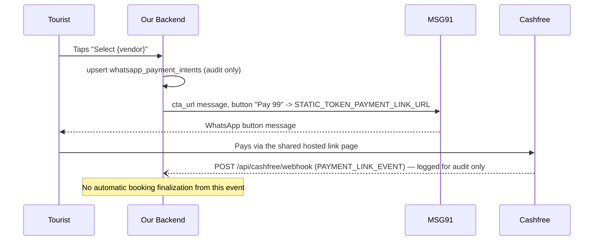

# Cashfree static-link workaround for the ₹99 token payment

> **Superseded 2026-09-17.** Everything below describes the temporary static-link workaround.
> It has been replaced by Cashfree PG Orders (`POST /pg/orders`), which restores automated
> per-booking payment confirmation — see
> [`2026-09-17-cashfree-pg-orders-integration.md`](./2026-09-17-cashfree-pg-orders-integration.md)
> for the current architecture. Kept here as a historical record of why the static link existed
> and what it traded away; do not use `STATIC_TOKEN_PAYMENT_LINK_URL` as a reference for new work
> — it no longer exists in code.

Companion to [`whatsapp-select-no-payment-link.md`](./whatsapp-select-no-payment-link.md) (that doc covers the
inbound-webhook reachability bug; this one covers what happens once the tap *does* reach
`send_token_payment_link`).

## Why this exists

Two separate Cashfree approval gates block every automated, per-booking payment-link path on
this merchant account:

1. **MSG91's session `payment_link` interactive type** creates a Cashfree **Order** under the
   hood through Cashfree's Server-to-Server (S2S) Orders API. Every attempt fails with Cashfree
   error `s2s_enabled_not_approved`, confirmed via MSG91's real delivery report API
   (`scripts/msg91-whatsapp-report-ping.ts`), not just a client-side guess.
2. **Cashfree's own dynamic Payment Links create-API** (`POST /pg/links`) was tried next as a
   direct workaround for (1) — it's a different Cashfree product, unaffected by
   `s2s_enabled_not_approved`. In production it also failed, with a different Cashfree error:
   `link_creation_api is not enabled or approved. Please reach out to care@cashfree.com.`
   (`feature_not_enabled`). Confirmed via Vercel runtime logs
   (`[token pay] cashfree link result { configured: true, success: false, error: "... PaymentLink_link_creation_api_failed ..." }`)
   during a real WhatsApp tap — credentials were loaded correctly, Cashfree's API itself rejected
   the call.

Both gates require Cashfree merchant-account approval; neither can be worked around in code.
**Current workaround:** send one dashboard-created static Cashfree Payment Link
(`https://payments.cashfree.com/links/Cb0o4hnupupg_AAAAAAAVUJE`, exported as
`STATIC_TOKEN_PAYMENT_LINK_URL` in `lib/whatsapp/tokenPaymentLink.ts`) for **every** ₹99 token
payment, delivered as a plain WhatsApp button (MSG91's `cta_url` interactive type — the same send
path already proven to work for quote cards, buttons, and lists).

The balance (dynamic-amount) payment in `lib/whatsapp/sendBalancePaymentLink.ts` is **not**
changed by this workaround and still goes through the old MSG91 `payment_link` flow — that will
need Cashfree S2S approval in a later iteration.

## Trade-off: no automated per-booking confirmation

Because the link is shared across every booking, a Cashfree webhook event for it carries no
unique per-booking identifier we control (`link_id` is the same static value every time). So:

- `app/api/cashfree/webhook/route.ts` still verifies the HMAC signature and **logs** each
  `PAYMENT_LINK_EVENT` (status, amount, last-4 of customer phone, event time) for manual/ops
  review, but it does **not** call `confirmPaymentByCrqid` or enqueue any follow-up job from a
  Cashfree event anymore.
- Marking a booking as paid/locked after a ₹99 token payment on the static link requires a manual
  step until a per-booking correlation mechanism exists again (e.g. Cashfree approves the
  dynamic create-API, or a different provider supports per-link metadata).
- MSG91's own "On Payment Report Received" webhook (`app/api/whatsapp/webhook`,
  `confirmPaymentByCrqid` in `lib/whatsapp/webhook/processWhatsAppWebhook.ts`) is unrelated to
  this and unaffected — it still confirms `lib/whatsapp/sendBalancePaymentLink.ts` payments.

## Flow



## Code map

| Piece | File |
|-------|------|
| Cashfree webhook signature verification + payload parsing (pure) | `lib/cashfree/pure.ts` |
| ₹99 token send (sends the static-link CTA button) | `lib/whatsapp/sendTokenPaymentLink.ts` |
| Static link URL + button text constants | `lib/whatsapp/tokenPaymentLink.ts` (`STATIC_TOKEN_PAYMENT_LINK_URL`, `TOKEN_PAY_BUTTON_TITLE`) |
| WhatsApp CTA-URL send (already existed, unchanged) | `sendWhatsAppCtaUrlMessage` in `lib/whatsapp/sendOutbound.ts` |
| Cashfree webhook route (audit-only logging) | `app/api/cashfree/webhook/route.ts` |
| Shared payment-confirmation logic (used only by MSG91's own webhook now) | `confirmPaymentByCrqid` in `lib/whatsapp/webhook/processWhatsAppWebhook.ts` |
| Audit columns (unused for correlation now, kept for history) | `whatsapp_payment_intents.cf_link_id`, `.payment_link_url` (migration `0020`, notes corrected in `0021`) |

`whatsapp_payment_intents` rows are still created/updated per tap for audit purposes
(`status`, `payment_link_url`, `wa_message_id`), but `crqid` is no longer sent to Cashfree as a
`link_id` — there is nothing to create anymore.

## Required environment variables

| Var | Notes |
|-----|-------|
| `CASHFREE_SECRET_KEY` | Only needed if `app/api/cashfree/webhook` stays deployed to verify + log events for the static link. Also the webhook HMAC secret (Cashfree's documented scheme). A `cfsk_ma_prod...` key is a **production** secret. |

`CASHFREE_APP_ID`, `CASHFREE_API_VERSION`, and `CASHFREE_WEBHOOK_NOTIFY_URL` are **no longer
used by any code** — they were only needed for the dynamic create/get API calls that are now
removed. If the static link's Cashfree dashboard settings have webhook notifications configured
(a dashboard-level setting, not something our code registers per-link), `app/api/cashfree/webhook`
will still receive and log events using only `CASHFREE_SECRET_KEY`.

## Cashfree webhook — audit logging only

Headers: `x-webhook-signature`, `x-webhook-timestamp`.

```json
{
  "data": {
    "cf_link_id": 14796319,
    "link_id": "<the static link's Cashfree id — same for every payment>",
    "link_status": "PAID",
    "link_amount": "99.00",
    "link_amount_paid": "99.00",
    "customer_details": { "customer_phone": "7889418789" }
  },
  "type": "PAYMENT_LINK_EVENT",
  "version": 1,
  "event_time": "2026-09-14T12:55:06+05:30"
}
```

Signature verification (`verifyCashfreeWebhookSignature` in `lib/cashfree/pure.ts`):

1. `HMAC-SHA256(x-webhook-timestamp + raw_body, CASHFREE_SECRET_KEY)`, base64-encoded.
2. Compare to `x-webhook-signature` with `crypto.timingSafeEqual` (not `===`).
3. Reject if the timestamp is more than 5 minutes off from server time (basic replay guard).

Must run on the Node.js runtime (`export const runtime = "nodejs"`) — `timingSafeEqual` is not
available on the Edge runtime.

On a valid, parseable `PAYMENT_LINK_EVENT`, the route logs
`[cashfree webhook] payment link event (audit only — manual confirmation required)` with the
status, amounts, last-4 of the customer phone, and event time, then acks `200`. It does not write
to `whatsapp_payment_intents`, does not call `confirmPaymentByCrqid`, and does not enqueue any
job — see "Trade-off" above.

## Known gaps / fast-follows

- **No automated confirmation.** This is the main open item — see "Trade-off" above. Revisit once
  Cashfree approves either gate, or another provider supports per-booking metadata.
- **Deno Edge Function copy is stale.** `supabase/functions/_shared/handlers/sendTokenPaymentLink.ts`
  still contains an older copy of this flow and was not updated in this pass — it's only relevant
  if the `job-queue-worker` Edge Function is ever deployed and enabled (it currently fails to
  invoke, so the Next.js in-process fallback in `lib/jobs/processDueJobs.ts` handles every job
  today). Port the same static-link change there before relying on that Edge Function.
- **Secret hygiene.** `CASHFREE_SECRET_KEY` is never logged or echoed in thrown errors or HTTP
  responses.
