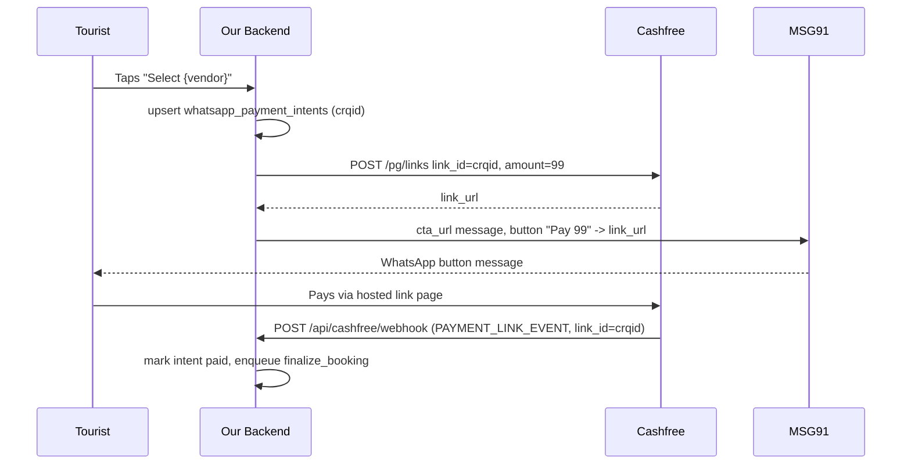

# Cashfree Payment Links workaround for the ₹99 token payment

Companion to [`whatsapp-select-no-payment-link.md`](./whatsapp-select-no-payment-link.md) (that doc covers the
inbound-webhook reachability bug; this one covers what happens once the tap *does* reach
`send_token_payment_link`).

## Why this exists

MSG91's session `payment_link` interactive type (used previously by
`lib/whatsapp/sendTokenPaymentLink.ts`) creates a Cashfree **Order** under the hood through
Cashfree's Server-to-Server (S2S) Orders API. That API is blocked on this merchant account —
every attempt fails with Cashfree error `s2s_enabled_not_approved`, confirmed via MSG91's real
delivery report API (`scripts/msg91-whatsapp-report-ping.ts`), not just a client-side guess.

Cashfree's separate **Payment Links API** (`POST /pg/links`) is a different product and is not
affected by that block. The workaround: create the Cashfree Payment Link ourselves and deliver
its URL as a plain WhatsApp button (MSG91's `cta_url` interactive type — a send path already
proven to work for quote cards, buttons, and lists), instead of routing through MSG91's
Cashfree-managed `payment_link` type at all.

The balance (dynamic-amount) payment in `lib/whatsapp/sendBalancePaymentLink.ts` is **not**
changed by this workaround and still goes through the old MSG91 `payment_link` flow — that will
need Cashfree S2S approval (or a similar direct-Payment-Links treatment) in a later iteration.

## Flow



## Code map

| Piece | File |
|-------|------|
| Cashfree API body/signature/webhook-parse (pure) | `lib/cashfree/pure.ts` |
| Cashfree client (reads env credentials) | `lib/cashfree/client.ts` |
| ₹99 token send (creates the link, sends the CTA button) | `lib/whatsapp/sendTokenPaymentLink.ts` |
| WhatsApp CTA-URL send (already existed, unchanged) | `sendWhatsAppCtaUrlMessage` in `lib/whatsapp/sendOutbound.ts` |
| Cashfree webhook route | `app/api/cashfree/webhook/route.ts` |
| Shared payment-confirmation logic (source-agnostic) | `confirmPaymentByCrqid` in `lib/whatsapp/webhook/processWhatsAppWebhook.ts` |
| Audit columns | `whatsapp_payment_intents.cf_link_id`, `.payment_link_url` (migration `0020`) |

`whatsapp_payment_intents.crqid` (already the intent's own id) is reused as Cashfree's
`link_id`, so both MSG91's own payment webhook and the new Cashfree webhook correlate through
the same column without a schema change to the correlation key itself.

## Required environment variables

| Var | Notes |
|-----|-------|
| `CASHFREE_APP_ID` | From the Cashfree merchant dashboard → Developers → API Keys. |
| `CASHFREE_SECRET_KEY` | Same page. A `cfsk_ma_prod...` key is a **production** secret — every call moves real money. Also doubles as the webhook HMAC secret (Cashfree's documented scheme). |
| `CASHFREE_API_VERSION` | Optional. Defaults to `2025-01-01` in code. |
| `CASHFREE_WEBHOOK_NOTIFY_URL` | Full public HTTPS URL of `app/api/cashfree/webhook`. Passed per-link as `link_meta.notify_url` — **no separate dashboard registration is needed** for Payment Links webhooks (unlike MSG91's Webhook (New), which is dashboard-configured). Cashfree cannot reach `localhost`; use a tunnel or the deployed Vercel URL, same caveat as `MSG91_WEBHOOK_SECRET` in the companion doc. |

There is no sandbox toggle — only production Cashfree keys exist for this merchant, so
`lib/cashfree/pure.ts` always targets `https://api.cashfree.com`.

## Cashfree API calls

### Create a link — `POST https://api.cashfree.com/pg/links`

Headers: `x-client-id`, `x-client-secret`, `x-api-version`, `content-type: application/json`.

```json
{
  "link_id": "<whatsapp_payment_intents.id>",
  "link_amount": 99,
  "link_currency": "INR",
  "link_purpose": "Token lock - <vendor name>",
  "link_partial_payments": false,
  "link_expiry_time": "2026-09-15T16:49:00+05:30",
  "customer_details": { "customer_phone": "7889418789" },
  "link_notify": { "send_sms": false, "send_email": false },
  "link_notes": { "quote_snapshot_id": "...", "purpose": "token_lock" },
  "link_meta": { "notify_url": "https://<host>/api/cashfree/webhook" }
}
```

Response includes `link_url` (sent to the customer) and `cf_link_id` (Cashfree's own numeric id,
stored for audit in `payment_link_url`/`cf_link_id`).

### Get an existing link — `GET https://api.cashfree.com/pg/links/{link_id}`

Same headers, no body. Used only as a fallback when create returns a duplicate-`link_id` error
(see Edge cases below).

### Webhook — `POST <CASHFREE_WEBHOOK_NOTIFY_URL>`

Headers: `x-webhook-signature`, `x-webhook-timestamp`.

```json
{
  "data": {
    "cf_link_id": 14796319,
    "link_id": "<intent id>",
    "link_status": "PAID",
    "link_amount": "99.00",
    "link_amount_paid": "99.00",
    "customer_details": { "customer_phone": "7889418789" }
  },
  "type": "PAYMENT_LINK_EVENT",
  "version": 1,
  "event_time": "2026-09-14T12:55:06+05:30"
}
```

Signature verification (`verifyCashfreeWebhookSignature` in `lib/cashfree/pure.ts`):

1. `HMAC-SHA256(x-webhook-timestamp + raw_body, CASHFREE_SECRET_KEY)`, base64-encoded.
2. Compare to `x-webhook-signature` with `crypto.timingSafeEqual` (not `===`).
3. Reject if the timestamp is more than 5 minutes off from server time (basic replay guard).

Must run on the Node.js runtime (`export const runtime = "nodejs"`) — `timingSafeEqual` is not
available on the Edge runtime.

## Edge cases handled

- **Duplicate `link_id` on retry.** If a previous `send_token_payment_link` attempt crashed
  after Cashfree accepted the create call but before we recorded the result, a retry reuses the
  same `link_id` (= `crqid`) and Cashfree rejects the create with a duplicate error.
  `createCashfreePaymentLinkWithConfig` detects this and falls back to `GET /pg/links/{link_id}`
  to recover the existing `link_url` instead of failing the whole send.
- **Partial payments.** `link_partial_payments: false` is always sent. If Cashfree still reports
  `PARTIALLY_PAID` (e.g. a merchant-dashboard setting overrides the per-link flag), the webhook
  route logs it as an error and does **not** finalize the booking — only `PAID` finalizes.
- **Stale/expired links.** `link_expiry_time` defaults to now + 24h, matching the WhatsApp 24h
  customer-care session window this message is already required to be sent inside. `CANCELLED`
  and `EXPIRED` webhook events mark the intent terminal-unpaid via the same logic MSG91's own
  payment webhook already used (`TERMINAL_UNPAID_STATUSES`).
- **Duplicate/out-of-order webhook delivery.** Cashfree retries on non-2xx and can send more than
  one `PAID` event. `confirmPaymentByCrqid` reuses the existing `markIntentPaid` (`already_paid`
  short-circuit) and `shouldEnqueuePaidFollowup` guards, so a second `PAID` event never
  double-enqueues `finalize_booking`.
- **Invalid/missing signature.** Rejected with 401/400 before any DB write or job enqueue.
- **Phone number format.** Cashfree's `customer_phone` must be a bare 10-digit number; our
  storage is E.164 (or already `+`-stripped). `toCashfreeCustomerPhone` strips both the leading
  `+` and a leading `91` country-code pair.
- **Unknown future webhook `type` values.** Acked with 200 and ignored rather than erroring, in
  case Cashfree adds new Payment Links event types later.
- **Secret hygiene.** `CASHFREE_SECRET_KEY` is never logged or echoed in thrown errors or HTTP
  responses.

## Missed-webhook safety net

Webhook delivery is not 100% guaranteed. If Cashfree's webhook never arrives (network blip,
`CASHFREE_WEBHOOK_NOTIFY_URL` briefly down, etc.), a paid intent can stay stuck in `sent`.
`lib/cashfree/reconcile.ts` (`reconcilePendingCashfreePaymentLinks`) polls
`GET /pg/links/{link_id}` for any `whatsapp_payment_intents` row with `purpose = 'token_lock'`,
`status = 'sent'`, and `payment_link_url` set, whose `updated_at` is older than
`CASHFREE_RECONCILE_STALE_MINUTES` (10), and reconciles it the same way the webhook route would.

This is wired into the existing once-daily `dispatch-jobs` Vercel Cron
(`app/api/cron/dispatch-jobs/route.ts`) rather than its own schedule — Vercel's Hobby plan caps
cron frequency at once per day (see `lib/jobs/hobbyCronSchedule.ts`), so a tight 10-minute loop
isn't deployable here without upgrading the plan. In practice this means the catch-up runs once a
day as a backstop; real-time confirmation still comes from `app/api/cashfree/webhook`. If the
project moves to a paid Vercel plan, point a more frequent cron at a route that calls
`reconcilePendingCashfreePaymentLinks` directly for tighter recovery.

There is also a Deno Edge Function copy of the old flow at
`supabase/functions/_shared/handlers/sendTokenPaymentLink.ts` (used only if the `job-queue-worker`
Edge Function is ever deployed and enabled — it currently fails to invoke, so the Next.js
in-process fallback in `lib/jobs/processDueJobs.ts` handles every job today). That copy was
**not** updated to the Cashfree Payment Links flow in this pass; if `job-queue-worker` is deployed
later, port the same change there or the S2S-blocked bug will resurface for jobs claimed by that
Edge Function.

## Rollout notes

There is no Cashfree sandbox for this merchant — only production keys. The very first real call
to `createCashfreePaymentLink` (however it is triggered — a manual smoke test or the first real
customer tap) moves real money. Before relying on this in front of customers, do one manual
smoke test: create a link, pay it yourself, and confirm `app/api/cashfree/webhook` receives and
signature-verifies the `PAID` event before trusting the automated path.
